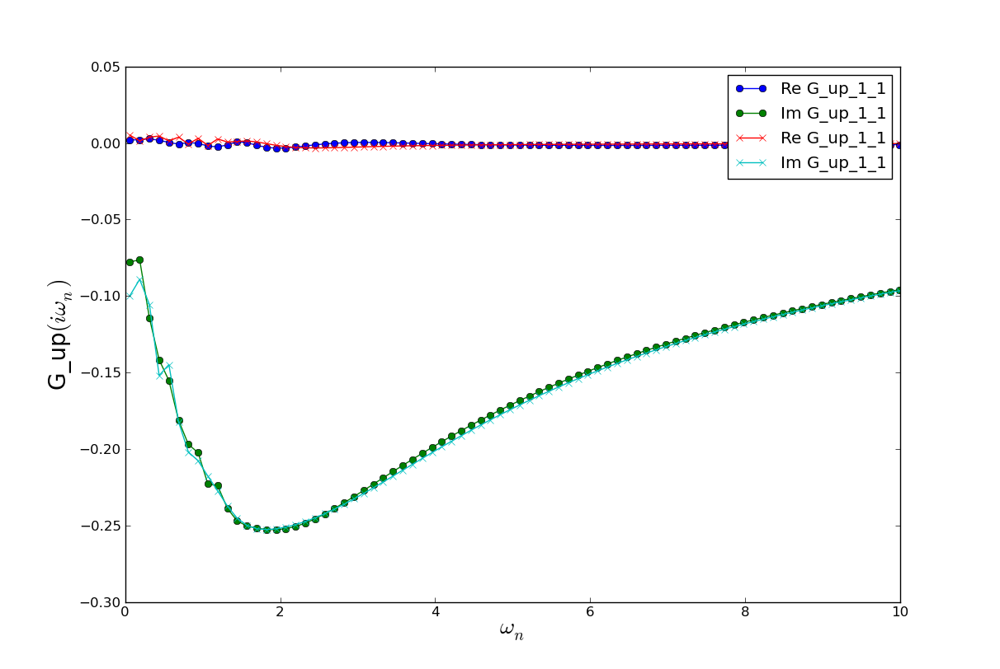

.. _random:

Random number generators
=========================

It is possible (and highly recommended!) to use different random number generators with the CTQMC solver.
Here is a list of the names of available generators:

* ``mt19937``
* ``mt11213b``
* ``lagged_fibonacci607``
* ``lagged_fibonacci1279``
* ``lagged_fibonacci2281``
* ``lagged_fibonacci3217``
* ``lagged_fibonacci4423``
* ``lagged_fibonacci9689``
* ``lagged_fibonacci19937``
* ``lagged_fibonacci23209``
* ``lagged_fibonacci44497``
* ``ranlux3``

The names in this list can then be used to set the ``random_name`` keyword argument
in the ``solve`` method of the CTQMC solver. Here is an example where the same run is done
twice, but using different random generator.

.. literalinclude:: several_random.py

The resulting Green's functions are:
  

As one can see from the plots, the two random number generators lead to very similar results.
On these short runs, one also notices that more statistics will be needed to have a reliable
Green's function at low frequencies.
